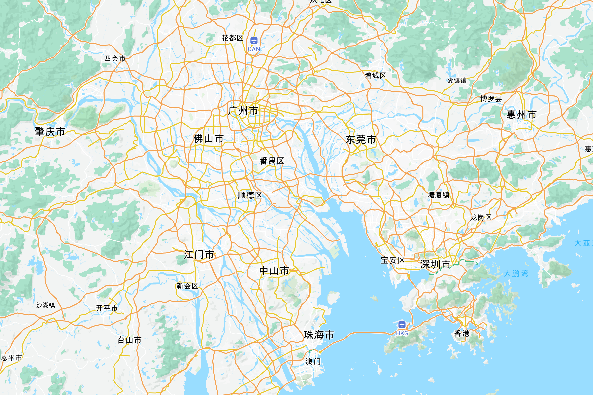

# Map Shear

基于 Vue 3 + Vite 使用 canvas 快速导出基于 Mapbox 样式的底图用于 Ai 等绘图应用。

可以通过自定义 Mapbox Token 使用自己的 Mapbox 地图样式或选择预设的地图样式。

使用桌面端浏览以获得最佳体验，浏览器窗口最小宽度应不小于 `720px`，以确保内容正确显示。

## Recommended IDE Setup

- [VS Code](https://code.visualstudio.com/) + [Vue - Official](https://marketplace.visualstudio.com/items?itemName=Vue.volar) (previously Volar) and disable Vetur
